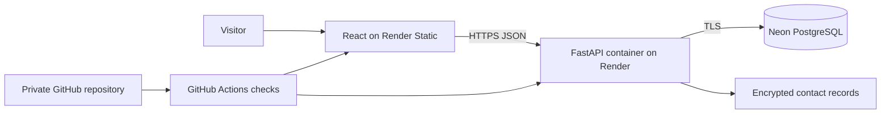

# Aryan Tembhekar — Enterprise Portfolio

A full-stack portfolio for analytics engineering, manufacturing systems, automation, and robotics.
It combines an animated React experience with a secure FastAPI administration surface and managed
PostgreSQL storage.

## Live architecture



The home page includes an interactive deployment trace that explains this path from commit to live
cloud infrastructure. Free Render services sleep while idle, so the first API request can take longer.

## Stack

- **Frontend:** React 19, TypeScript, Vite, Tailwind CSS, Motion, Radix UI
- **Backend:** FastAPI, SQLAlchemy async, Alembic, Uvicorn
- **Data:** Neon PostgreSQL with application-level encryption for contact details
- **Security:** Argon2 password hashing, signed session cookies, CSRF protection, strict CORS,
  trusted hosts, request limits, security headers, and environment-managed secrets
- **Delivery:** Render, Docker, GitHub Actions

## Product surface

```text
/                    Positioning, impact, featured work, and cloud deployment story
/work                Filterable project portfolio
/work/:slug          Detailed case studies
/journey             Professional and engineering timeline
/expertise           Capability map and technical principles
/lab                 Interactive analytics and spreadsheet demos
/contact             Encrypted professional contact flow
/admin                Private administration dashboard
```

## Repository

```text
apps/web/             React frontend
apps/api/             FastAPI backend, migrations, scripts, and tests
.github/workflows/    Continuous integration
docs/                 Deployment, security, design, and publishing notes
render.yaml           Render backend infrastructure definition
docker-compose.yml    Local PostgreSQL and API services
```

## Local development

Requirements: Node.js 22+, Python 3.12+, `uv`, and Docker.

```bash
cp .env.example .env
make setup
make secrets
docker compose up -d db
make admin
make seed
```

Start the applications in separate terminals:

```bash
make dev-api
make dev-web
```

The frontend runs at `http://localhost:5173`; the API runs at `http://localhost:8000`.

## Quality checks

```bash
make lint
make test
make build
```

GitHub Actions repeats the frontend type/build checks and backend lint/tests on every pull request and
push to `main`.

## Cloud deployment

Production uses a private GitHub repository, a Render Static Site, a Render Web Service, and Neon.
Secrets stay in Render and never belong in Git. Follow [docs/CLOUD_DEPLOYMENT.md](docs/CLOUD_DEPLOYMENT.md)
for the reproducible setup and required environment variables.

The API container automatically applies migrations, creates or refreshes the configured administrator,
and inserts only missing starter projects. Existing projects edited through the admin interface are
preserved across redeployments.

## Documentation

- [Cloud deployment](docs/CLOUD_DEPLOYMENT.md)
- [Security model](docs/SECURITY.md)
- [Design and motion system](docs/DESIGN_SYSTEM.md)
- [Public content checklist](docs/PORTFOLIO_CONTENT.md)

Before publishing professional claims, verify every metric and remove employer-confidential details.
