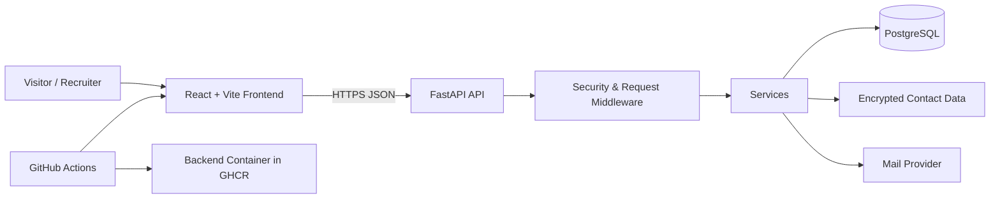

<<<<<<< HEAD
# Aryan Tembhekar — Enterprise Portfolio

A production-oriented portfolio monorepo that demonstrates the way Aryan works: understand an operational problem, model the data, automate the workflow, build the backend, create a clean interface, validate the result, and preserve human decision-making for critical actions.

The portfolio content is seeded from Aryan's analytics, manufacturing, automation, robotics, and leadership experience. Replace company-confidential details with safe summaries before publishing.

## Architecture



## What this repository demonstrates

- A multi-page React, TypeScript, Vite, Tailwind CSS, and Motion experience with route-level code splitting, interactive case studies, scroll-linked timelines, shared layout transitions, and a profile-specific animated background.
- FastAPI, Uvicorn, SQLAlchemy, PostgreSQL, API validation, authentication, admin CRUD, and mail automation.
- Password hashing, encrypted contact data, CSRF protection, strict CORS, security headers, request IDs, rate limiting, and secrets through environment variables.
- GitHub Actions for quality checks, GitHub Pages deployment, and backend container publishing.
- A modular monolith: enterprise structure without premature microservices or hard-to-follow abstractions.


## Portfolio experience

The public site is no longer a single landing page. It includes:

- `/` — positioning, animated decision-engine hero, metrics, featured work, workflow, and journey preview.
- `/work` — filterable system portfolio.
- `/work/:slug` — dedicated case studies with problem, approach, impact, architecture, and confidentiality notes.
- `/journey` — scroll-linked professional, research, leadership, and education timeline.
- `/expertise` — capability depth, system layers, and engineering principles.
- `/lab` — current ERP, AI-assisted engineering, performance, and robotics learning.
- `/contact` — focused professional outreach and secure backend contact flow.

The background visual combines diamond-facet geometry, data nodes, blueprint grids, and system-flow animation to connect Aryan's manufacturing, analytics, and robotics experience. See [docs/DESIGN_SYSTEM.md](docs/DESIGN_SYSTEM.md).

## Repository layout

```text
apps/web/     Multi-page React portfolio and private admin interface
apps/api/     FastAPI API, database models, security, services, tests
.github/      CI, Pages deployment, and backend image publishing
docs/         Architecture, security, content, and learning notes
```

## Local setup

1. Copy `.env.example` to `.env`.
2. Generate production-grade secrets:

   ```bash
   cd apps/api
   uv sync --all-groups
   uv run python scripts/generate_secrets.py
   ```

3. Place the generated values into the root `.env`.
4. Start PostgreSQL:

   ```bash
   docker compose up -d db
   ```

5. Start the API:

   ```bash
   cd apps/api
   uv run alembic upgrade head
   uv run python scripts/create_admin.py
   uv run python scripts/seed.py
   uv run uvicorn app.main:app --reload
   ```

6. Start the frontend in a second terminal:

   ```bash
   cd apps/web
   npm install
   npm run dev
   ```

## Deployment model

### Frontend: GitHub Pages

The `deploy-pages.yml` workflow builds the Vite application and publishes it to GitHub Pages. Add a GitHub repository variable named `VITE_API_BASE_URL` that points to the deployed API, for example:

```text
https://api.your-domain.com/api/v1
```

### Backend: container host

GitHub Pages is static hosting and cannot run Python. The `backend-image.yml` workflow publishes a Docker image to GitHub Container Registry. Run that image on a container host and configure HTTPS, PostgreSQL, environment variables, and the exact frontend origin.

### LinkedIn integration

The public site links to Aryan's LinkedIn profile. A real LinkedIn sign-in or share integration must use LinkedIn's approved OAuth/OpenID products and permissions. Automated connection requests are intentionally not implemented.

## Before going public

- Replace the GitHub placeholder URL in `apps/web/src/data/profile.ts`.
- Confirm every impact metric and remove confidential company details.
- Use a custom domain for a stronger professional identity.
- Set `ENVIRONMENT=production`, strong secrets, HTTPS-only cookies, exact allowed origins, and production PostgreSQL backups.
- Run `npm audit`, `uv run ruff check .`, `uv run pytest`, and dependency updates before each release.

See [docs/LEARNING_PATH.md](docs/LEARNING_PATH.md) for the build-and-learn sequence and [docs/DESIGN_SYSTEM.md](docs/DESIGN_SYSTEM.md) for the visual and motion architecture.
=======
# Aryan_Dev_Port
New portfolio website 
>>>>>>> origin/main
